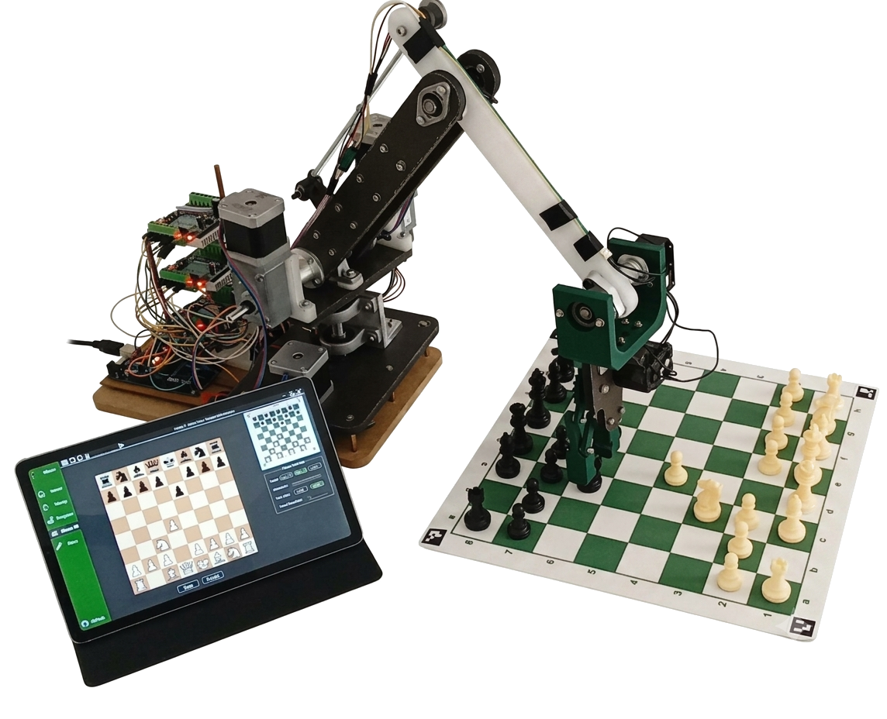
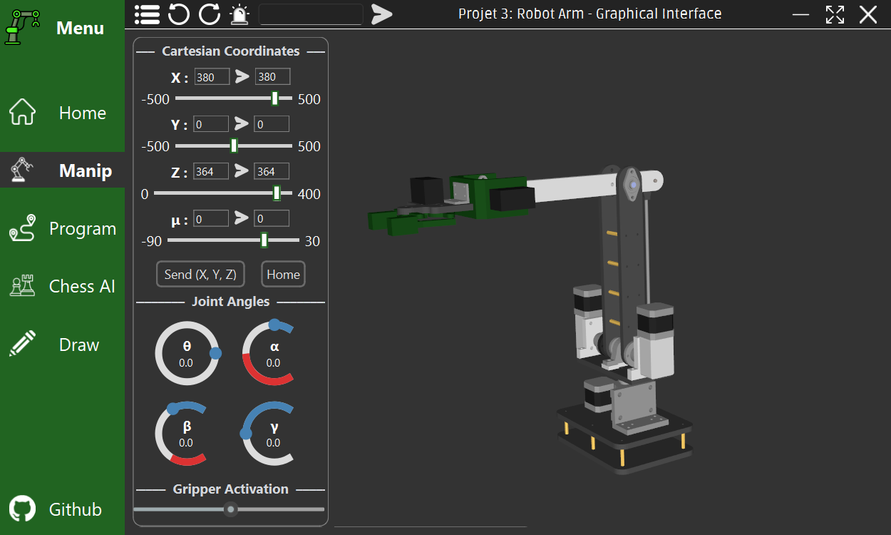
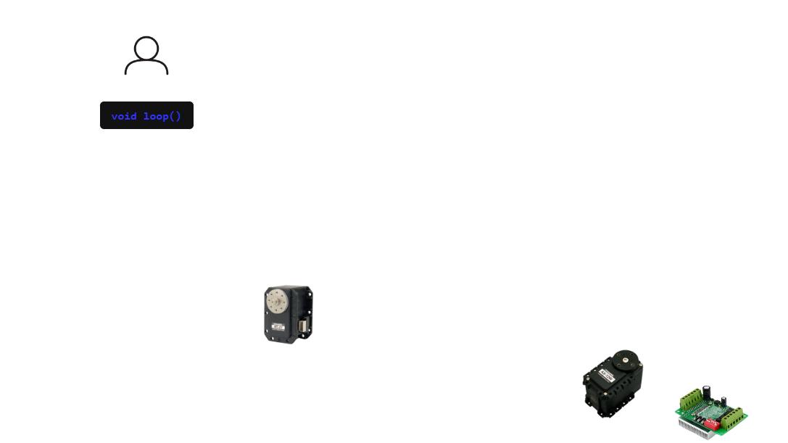
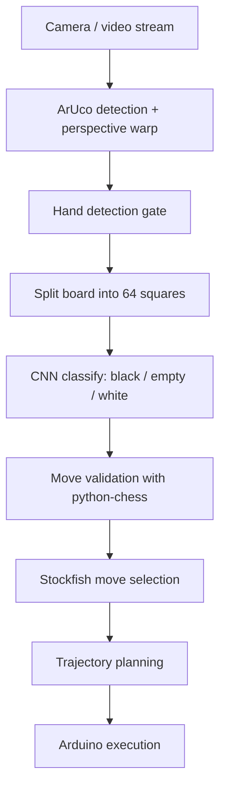

# Chess-Playing Robot Arm
This repository contains work related to my third engineering project at EMINES.

It involves a robotic arm control and GUI with an integrated chess pipeline. The project combines a PySide6 desktop app, computer vision for chess board detection, a lightweight CNN classifier for chessboard squares, Stockfish move generation, and time-optimal trajectory planning that drives Arduino firmware.




## Highlights

- GUI application for robot visualization and control.
- Chess board detection using ArUco markers and hand-presence gating.
- CNN-based per-square classification (black, empty, white).
- Move validation with python-chess and move generation with Stockfish.
- Trajectory planning and Arduino command generation for real hardware.

## Main repository elements

- [GUI/](GUI/)
  - Main desktop app entrypoint: [GUI/main.py](GUI/main.py)
  - Kinematics and planning: [GUI/kinematics.py](GUI/kinematics.py), [GUI/planner.py](GUI/planner.py)
  - Real-time 3D rendering: [GUI/ThreeD.py](GUI/ThreeD.py)
  - Chess subsystem: [GUI/Chess/](GUI/Chess/)
- [AI/](AI/)
  - Training data: [AI/data/](AI/data/)
  - Training script: [AI/train/train.py](AI/train/train.py)
  - Inference helpers: [AI/Inference/](AI/Inference/)
- [Arduino/RoboticArm/src/](Arduino/RoboticArm/)
    - [main.cpp](Arduino/RoboticArm/src/main.cpp) - Firmware entrypoint; reads serial, runs trajectories, and streams feedback.
    - [serial_commands.cpp](Arduino/RoboticArm/src/serial_commands.cpp) - Serial protocol parsing and command dispatch.
    - [trajectory.cpp](Arduino/RoboticArm/src/trajectory.cpp) - Trajectory scheduling, interpolation, and waypoint execution.
    - [cartesian.cpp](Arduino/RoboticArm/src/cartesian.cpp) - Cartesian line and circle path generators.
    - [kinematics.cpp](Arduino/RoboticArm/src/kinematics.cpp) - Inverse/direct kinematics and mu/gamma helpers.
    - [control.cpp](Arduino/RoboticArm/src/control.cpp) - Hardware Stepper control and DXL gripper actuation.
    - [feedback.cpp](Arduino/RoboticArm/src/feedback.cpp) - Telemetry output for joint and gripper state.
    - [reset.cpp](Arduino/RoboticArm/src/reset.cpp) - Homing and reset routine using limit switches.
    - [config.cpp](Arduino/RoboticArm/src/config.cpp) - Hardware configuration and runtime state.

Here is a diagram simplifying the control firmware architecture of the robot:
(change github theme if invisible)
<picture>
  <source media="(prefers-color-scheme: dark)" srcset="images/diagram_light.png">
  
</picture>

## GUI menus

- Home: project overview and quick access to features.
- Manip: robot manual control with real-time 3D visualization.
- Program: save and execute waypoint lists.
- Chess AI: vision + engine pipeline and robot move execution.
- Drawing interface: draw paths for the arm to follow.

## Chess pipeline

1. **Capture and rectify**: ArUco markers define board corners, then the board is perspective-corrected into inner and outer crops. See [GUI/Chess/board_detector.py](GUI/Chess/board_detector.py).
2. **Hand detection**: Canny edges on the border stripe gate processing while a hand is present. See [GUI/Chess/board_detector.py](GUI/Chess/board_detector.py).
3. **Square classification**: The inner crop is split into 64 squares and classified as black, empty, or white by a CNN. See [GUI/Chess/board_detector.py](GUI/Chess/board_detector.py).
4. **Move validation**: Detected color changes are matched against legal moves using python-chess. See [GUI/Chess/chess_manager.py](GUI/Chess/chess_manager.py).
5. **Engine move**: Stockfish generates the best move for the robot side. See [GUI/Chess/chess_engine.py](GUI/Chess/chess_engine.py).
6. **Trajectory generation**: The move is converted into a Cartesian path and then time-optimized into joint waypoints. See [GUI/planner.py](GUI/planner.py).
7. **Firmware execution**: Waypoints are serialized into Arduino commands and executed by the arm firmware. See [Arduino/RoboticArm/](Arduino/RoboticArm/).

## Chess pipeline diagram



## Setup

1. Create and activate a Python environment.
2. Install dependencies:

```bash
pip install -r requirements.txt
```

3. Stockfish setup:
  - [Download a Stockfish binary](https://github.com/official-stockfish/Stockfish/releases/tag/sf_18)
  - Update the executable path used in [GUI/Chess/chess_engine.py](GUI/Chess/chess_engine.py).

If you plan to use CUDA for training or inference, install a torch build that matches your GPU and CUDA version.

## Run the GUI

```bash
python GUI/main.py
```

The GUI loads configuration and assets from [GUI/](GUI/).

## Run the chess board detector (standalone)

```bash
python GUI/Chess/main.py
```

Input mode defaults to IP camera in [GUI/Chess/config.py](GUI/Chess/config.py). Update `mode`, `camera_index`, or `camera_ip` as needed.

## Run CNN inference (single image)

From [AI/Inference/](AI/Inference/), place `image.jpg` or `image.png` in the folder, then:

```bash
python AI/Inference/inference.py
```

For a drag-and-drop GUI:

```bash
python AI/Inference/gui_inference.py
```

## Train the CNN

Organize images with `torchvision.datasets.ImageFolder` layout:

```
AI/data/
  train/
    black/
    empty/
    white/
  test/
    black/
    empty/
    white/
```

Then run:

```bash
python AI/train/train.py
```

The training script writes `best_model.pth` in [AI/train/](AI/train/).

## Arduino firmware (PlatformIO)

- Robotic arm firmware: open [Arduino/RoboticArm/](Arduino/RoboticArm/) in PlatformIO and build/upload for `megaatmega2560`.
- Mini arm firmware: open [Arduino/MiniArm/](Arduino/MiniArm/) in PlatformIO and build/upload for `megaatmega2560` (env name is `uno`).

## Packaging the GUI

A PyInstaller spec is provided:

```bash
pyinstaller RobotArmGUI.spec
```

Build artifacts are placed under [build/RobotArmGUI/](build/RobotArmGUI/).

## Notes

- The chess engine uses Stockfish via python-chess. Provide a Stockfish binary and ensure the path used in [GUI/Chess/chess_engine.py](GUI/Chess/chess_engine.py) is valid for your system.
- If camera detection is unreliable, tune parameters in [GUI/Chess/config.py](GUI/Chess/config.py).
